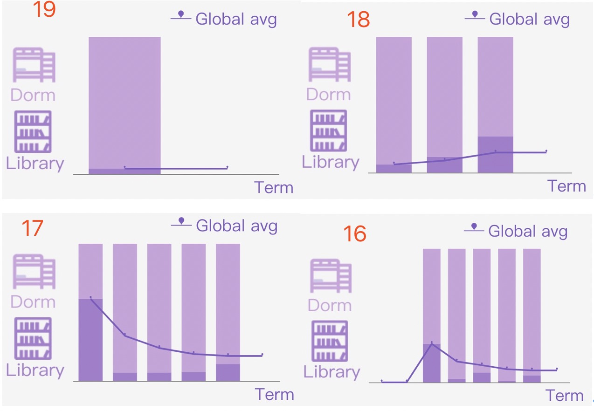

# 本周工作时长：
- 12h

# 本周工作成果：
1. debug一芃学姐写的leave_data API
- 已经可连
2. 前端代码连接该API
3. 现有已经发现的问题
- echarts里没有找到仅显示一个label的配置选项，3-pie图的引导线容易覆盖别的文字，label文字过长（1920*1080可正常显示），已改为legend

- 1920学期没有dorm vs. lib的数据，该表格会空出一列

- dorm_lib 和 gpa_trend不同的显示方法

- 考虑到是概览页面，所有的tooltip我都关掉了

# 下周工作计划：
* 待定
